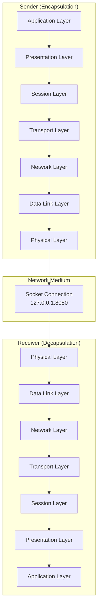

# OSI 7-Layer Network Model Simulation

A complete implementation of the OSI 7-layer network model in C with real socket communication and Python visualization. This project demonstrates data encapsulation, transmission, and decapsulation across all seven layers with color-coded progress tracking.

[](https://en.wikipedia.org/wiki/C_%28programming_language%29)
[](https://en.wikipedia.org/wiki/OSI_model)
[](https://en.wikipedia.org/wiki/Network_socket)
[](https://python.org)
[](https://en.wikipedia.org/wiki/Network_simulation)
[](https://ubuntu.com)
[](https://en.wikipedia.org/wiki/Educational_technology)
[](https://en.wikipedia.org/wiki/Makefile)

---

# Table of Contents

* [Overview](#overview)
* [Project Structure](#project-structure)
* [Architecture](#architecture)
* [Installation](#installation)
* [Usage](#usage)
* [OSI Layer Implementation](#osi-layer-implementation)
* [Visualization](#visualization)
* [Extending the Project](#extending-the-project)
* [Testing](#testing)
* [Performance Metrics](#performance-metrics)
* [Contributing](#contributing)
* [License](#license)

---

# Overview

This project simulates the complete OSI 7-layer network model using:

* **C-based client/server architecture**
* **Real socket communication**
* **Python-based visualization**
* **Layer-by-layer encapsulation and decapsulation**
* **Color-coded logs for debugging**
* **Error simulation capabilities**

It is designed as an educational project for learning:

* Computer networking fundamentals
* OSI layer responsibilities
* Socket programming in C
* Data encapsulation concepts
* Client-server communication

---

# Project Structure

```text
osi-network-simulator/
│
├── src/
│   ├── main.c              # Main application entry point
│   ├── layers.h            # Function declarations
│   └── layers.c            # OSI layer implementations
│
├── python/
│   └── visualizer.py       # Python visualization tool
│
├── tests/
│   └── test_communication.sh
│
├── Makefile
└── README.md
```

---

# Architecture



---

# Installation

## Prerequisites

Install GCC and Python:

```bash
sudo apt update
sudo apt install gcc make python3 python3-pip
```

Install Python dependencies:

```bash
pip3 install colorama termcolor
```

---

## Build From Source

```bash
git clone https://github.com/yourusername/osi-network-simulator.git

cd osi-network-simulator

make
```

Verify the executable:

```bash
ls -la osi
```

---

# Usage

## Basic Execution

Run with default settings:

```bash
./osi
```

Run with a custom message:

```bash
./osi "Hello from OSI layers!"
```

Run with verbose output:

```bash
./osi -v "Test message"
```

---

# Python Visualization

Launch the visualizer:

```bash
python3 python/visualizer.py
```

Run with custom data:

```bash
python3 python/visualizer.py --message "Network test"
```

---

# Example Output

```text
OSI 7-Layer Simulation Started
──────────────────────────────────────

Layer 7: Application
Data: "Hello World!"

Layer 6: Presentation
Encrypting data...

Layer 5: Session
Establishing session...

Layer 4: Transport
Adding TCP header...

Layer 3: Network
Adding IP header...

Layer 2: Data Link
Creating Ethernet frame...

Layer 1: Physical
Transmitting bits...

Transmission complete!
──────────────────────────────────────

Starting Decapsulation...

Layer 1: Physical → Bits received
Layer 2: Data Link → Frame processed
Layer 3: Network → IP header removed
Layer 4: Transport → TCP header removed
Layer 5: Session → Session closed
Layer 6: Presentation → Data decrypted
Layer 7: Application → Final data received

Transmission successful!
```

---

# OSI Layer Implementation

Each layer implements two primary functions:

| Layer        | Send Function      | Receive Function   | Responsibility              |
| ------------ | ------------------ | ------------------ | --------------------------- |
| Application  | `app_send()`       | `app_recv()`       | User interaction            |
| Presentation | `present_send()`   | `present_recv()`   | Encryption and formatting   |
| Session      | `session_send()`   | `session_recv()`   | Session management          |
| Transport    | `transport_send()` | `transport_recv()` | End-to-end delivery         |
| Network      | `network_send()`   | `network_recv()`   | Routing and addressing      |
| Data Link    | `datalink_send()`  | `datalink_recv()`  | Framing and error detection |
| Physical     | `physical_send()`  | `physical_recv()`  | Bit transmission            |

---

## Example Layer Code

```c
void transport_send(char *data) {
    printf("[Transport] Adding TCP header to: %s\n", data);

    char tcp_data[1024];
    sprintf(tcp_data, "TCP_HDR|%s", data);

    network_send(tcp_data);
}

void transport_recv(char *data) {
    printf("[Transport] Removing TCP header\n");

    char *original_data = strstr(data, "|");
    if (original_data != NULL) {
        session_recv(original_data + 1);
    }
}
```

---

# Visualization

The Python visualizer includes:

* Real-time layer tracking
* Color-coded layer display
* Animated data flow
* Timestamp logging
* Encapsulation/decapsulation visualization

---

## Layer Color Mapping

```python
LAYER_COLORS = {
    "Application": "GREEN",
    "Presentation": "CYAN",
    "Session": "MAGENTA",
    "Transport": "YELLOW",
    "Network": "BLUE",
    "DataLink": "RED",
    "Physical": "WHITE"
}
```

---

## Example Progress Display

```text
┌──────────────────────────────────────┐
│        OSI Model Data Flow           │
├──────────────────────────────────────┤
│ App → Pres → Sess → Trans            │
│ Trans → Net → DataLink → Phys        │
│ Phys → DataLink → Net → Trans        │
│ Trans → Sess → Pres → App            │
└──────────────────────────────────────┘
```

---

# Extending the Project

## Error Simulation

Example implementation:

```c
void simulate_error(int layer, int error_type) {

    switch(error_type) {

        case 1:
            printf("Layer %d: Data corruption simulated\n", layer);
            break;

        case 2:
            printf("Layer %d: Packet drop simulated\n", layer);
            break;

        case 3:
            printf("Layer %d: Transmission delay simulated\n", layer);
            sleep(2);
            break;
    }
}
```

---

## Future Enhancements

Possible additions:

* IPv6 support
* Real encryption using OpenSSL
* GUI visualization using Tkinter or PyQt
* Wireshark-compatible packet export
* Docker support
* Multi-threaded processing
* Packet fragmentation simulation

---

# Testing

Run the test suite:

```bash
cd tests

./test_communication.sh
```

Additional tests:

```bash
./osi "Short test"

./osi "$(cat large_file.txt)"

./osi --stress-test 1000
```

---

# Performance Metrics

The simulator can track:

* Encapsulation time
* Decapsulation time
* Transmission latency
* Round-trip time
* Memory usage per layer

---

# Contributing

1. Fork the repository
2. Create a feature branch

```bash
git checkout -b feature/new-feature
```

3. Commit changes

```bash
git commit -m "Add new feature"
```

4. Push to GitHub

```bash
git push origin feature/new-feature
```

5. Open a Pull Request

---

# Acknowledgments

* Inspired by university networking courses
* Based on the OSI model standard (ISO/IEC 7498-1)
* Socket programming concepts inspired by Beej’s Guide to Network Programming

---

# Quick Start

```bash
# Build the project
make

# Run simulation
./osi "Learning OSI layers!"

# Start visualization
python3 python/visualizer.py --animate

# Clean build files
make clean
```

---

**Start exploring computer networking with a complete OSI layer simulation built in C and Python.**
